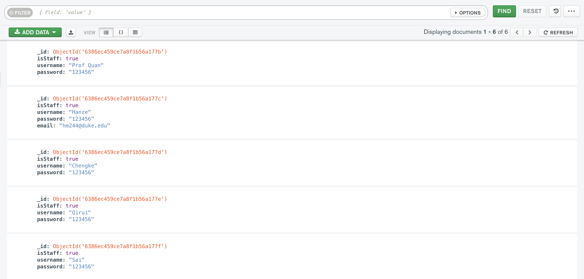

# Office Hour Queue
> This project will be developed based on one of my assignments in **COMPSCI590: Advanced Web Application Development** at Duke University.
> Additional features will be added.

## Brief

A platform for students to sign up and briefly describe their problem during office hour. The TA can see all the problems and come to each student in turn.

## Basic Components

Students need to register in order to ask questions. Staffs are pre-defined in MongoDB:

There are 4 working screens, one for sign in and sign up, one for students, one for staff and one for redirecting:

- Sign in / Sign up (When button got clicked, customer will be redirected to keycloak)
    
    
    
- Student Screen
    
    
    
- Staff Screen
    
    
    
- Redirect screen has the same background as sign up screen

## How to run this project

1. open any terminal, run `docker run -p 127.0.0.1:27017:27017 -d --rm --name mongo mongo:6.0.2` (since MongoDB is containerized by Docker, and docker is configured as global in my laptop)
    
    
    
2. open MongoDB compass, connect
    
    
    
3. cd to `server/`, then run `npm run setup` （Skip this step if MongoDB Compass has already started）
    
    
    
    Then we can see the query in Mongo:
    
    
    
4. run `npm start` in `/server` and `/ui`

##
